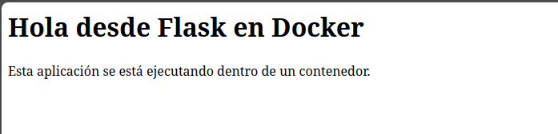
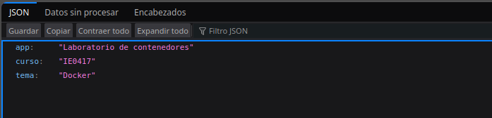
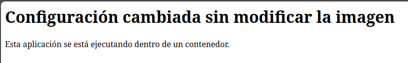

# Parte 7: publicación de puertos

## Paso: docker run con el puerto 5000

**Qué se hizo:** Se ejecutó la aplicación Flask dentro de un contenedor llamado `app-puertos`, publicando el puerto `5000` del contenedor en el puerto `5000` del host.

**Comando ejecutado:**

```bash
docker run --name app-puertos -p 5000:5000 laboratorio-flask:1.0
```

**Explicación (para qué sirve el comando):** El comando `docker run` crea y ejecuta un contenedor a partir de la imagen `laboratorio-flask:1.0`. La opción `--name app-puertos` asigna un nombre al contenedor y la opción `-p 5000:5000` publica el puerto `5000` del contenedor en el puerto `5000` del host.

El formato utilizado por Docker es:

```text
-p PUERTO_HOST:PUERTO_CONTENEDOR
```

Por lo tanto, en:

```text
-p 5000:5000
```

el primer `5000` corresponde al puerto del host y el segundo `5000` corresponde al puerto del contenedor.

**Resultado obtenido:**

```text
* Serving Flask app 'app'
* Debug mode: off
WARNING: This is a development server. Do not use it in a production deployment. Use a production WSGI server instead.
* Running on all addresses (0.0.0.0)
* Running on http://127.0.0.1:5000
* Running on http://172.17.0.2:5000
Press CTRL+C to quit
172.17.0.1 - - [07/Oct/2026 19:26:53] "GET / HTTP/1.1" 200 -
172.17.0.1 - - [07/Oct/2026 19:26:53] "GET /favicon.ico HTTP/1.1" 404 -
172.17.0.1 - - [07/Oct/2026 19:29:10] "GET /info HTTP/1.1" 200 -
```

Debido a que el laboratorio se realizó en GitHub Codespaces, el acceso desde el navegador se hizo mediante la URL reenviada por Codespaces para el puerto `5000`, en lugar de utilizar directamente `http://localhost:5000`.

La página principal se mostró correctamente:



También se verificó la ruta `/info`:



**Reflexión:** La aplicación respondió correctamente tanto en la ruta principal `/` como en `/info`. Los códigos `200` observados en la terminal indican que ambas solicitudes fueron atendidas correctamente. Esto permitió comprobar que el mapeo `5000:5000` hizo accesible desde el host la aplicación que escucha en el puerto `5000` dentro del contenedor.

## Paso: detener y eliminar el contenedor app-puertos

**Qué se hizo:** Se detuvo y posteriormente se eliminó el contenedor `app-puertos`.

**Comandos ejecutados:**

```bash
docker stop app-puertos
docker rm app-puertos
```

**Explicación (para qué sirven los comandos):** `docker stop` detiene un contenedor que está en ejecución, mientras que `docker rm` elimina un contenedor que ya se encuentra detenido.

**Resultado obtenido:**

```text
app-puertos
app-puertos
```

**Reflexión:** El contenedor se detuvo y eliminó correctamente. Esto permitió liberar el puerto utilizado y continuar con la siguiente prueba del laboratorio.

## Paso: docker run con el puerto 8080

**Qué se hizo:** Se ejecutó nuevamente la aplicación Flask en un segundo contenedor llamado `app-puertos-2`, publicando el puerto `5000` del contenedor en el puerto `8080` del host.

**Comando ejecutado:**

```bash
docker run --name app-puertos-2 -p 8080:5000 laboratorio-flask:1.0
```

**Explicación (para qué sirve el comando):** En este caso, la opción:

```text
-p 8080:5000
```

indica que el puerto `8080` pertenece al host y se conecta con el puerto `5000` del contenedor.

La aplicación Flask no cambió su configuración y continuó escuchando internamente en el puerto `5000`. Únicamente cambió el puerto utilizado desde el host para acceder a ella.

**Resultado obtenido:**

```text
* Serving Flask app 'app'
* Debug mode: off
WARNING: This is a development server. Do not use it in a production deployment. Use a production WSGI server instead.
* Running on all addresses (0.0.0.0)
* Running on http://127.0.0.1:5000
* Running on http://172.17.0.2:5000
Press CTRL+C to quit
172.17.0.1 - - [07/Oct/2026 19:31:08] "GET / HTTP/1.1" 200 -
172.17.0.1 - - [07/Oct/2026 19:31:08] "GET /favicon.ico HTTP/1.1" 404 -
```

**Reflexión:** La aplicación funcionó correctamente utilizando el puerto `8080` del host, aunque Flask continuó ejecutándose en el puerto `5000` dentro del contenedor. Esto demuestra que el puerto del host y el puerto del contenedor no tienen que ser iguales.

## Paso: detener y eliminar el contenedor app-puertos-2

**Qué se hizo:** Se detuvo y eliminó el segundo contenedor después de completar la prueba.

**Comandos ejecutados:**

```bash
docker stop app-puertos-2
docker rm app-puertos-2
```

**Resultado obtenido:**

```text
app-puertos-2
app-puertos-2
```

**Reflexión:** El segundo contenedor se detuvo y eliminó correctamente, dejando el entorno preparado para continuar con las siguientes partes del laboratorio.

## Diferencia entre -p 5000:5000 y -p 8080:5000

En ambos casos, el segundo número corresponde al puerto dentro del contenedor y permanece en `5000`, porque ese es el puerto en el que escucha la aplicación Flask.

En:

```text
-p 5000:5000
```

el puerto `5000` del host se conecta con el puerto `5000` del contenedor.

En:

```text
-p 8080:5000
```

el puerto `8080` del host se conecta con el puerto `5000` del contenedor.

Por lo tanto, el puerto del host puede cambiar sin necesidad de modificar el puerto interno utilizado por la aplicación.

## Preguntas de reflexión de la Parte 7

1. **¿Por qué no basta con que la aplicación escuche en el puerto 5000 dentro del contenedor?**

   Porque el puerto dentro del contenedor pertenece a su propio entorno de red. Para poder acceder a la aplicación desde el host, es necesario publicar ese puerto mediante la opción `-p`.

2. **¿Qué función cumple el mapeo de puertos?**

   El mapeo de puertos permite conectar un puerto del host con un puerto dentro del contenedor. De esta forma, las solicitudes que llegan al puerto publicado del host son dirigidas hacia el puerto donde escucha la aplicación dentro del contenedor.

3. **¿Cuál es la diferencia entre el puerto del host y el puerto del contenedor?**

   El puerto del host es el puerto utilizado desde fuera del contenedor para acceder al servicio. El puerto del contenedor es el puerto en el que la aplicación escucha internamente.

   Por ejemplo, en:

   ```text
   -p 8080:5000
   ```

   `8080` corresponde al host y `5000` corresponde al contenedor.

4. **¿Qué pasaría si dos contenedores intentan usar el mismo puerto del host?**

   Docker no podría publicar el mismo puerto del host para ambos contenedores al mismo tiempo. Uno de ellos tendría que utilizar otro puerto del host, por ejemplo `8080`, aunque ambos pueden seguir utilizando internamente el mismo puerto `5000`.

---

# Parte 8: logs e inspección de contenedores

## Logs e inspección

## Paso: ejecutar el contenedor en segundo plano

**Qué se hizo:** Se ejecutó la aplicación Flask dentro de un contenedor llamado `app-logs` en segundo plano, publicando el puerto `5000` del contenedor en el puerto `5000` del host.

**Comando ejecutado:**

```bash
docker run -d --name app-logs -p 5000:5000 laboratorio-flask:1.0
```

**Explicación (para qué sirve el comando):** La opción `-d` permite ejecutar el contenedor en segundo plano. De esta forma, el contenedor continúa funcionando sin mantener ocupada la terminal.

**Resultado obtenido:**

```text
4a4913e9b05cb79dd8601102ef1bceaf30c616103e5c380903b9de9e23454487
```

**Reflexión:** Al utilizar `-d`, Docker devolvió el identificador del contenedor y permitió continuar utilizando la terminal mientras la aplicación permanecía activa.

## Paso: docker logs

**Qué se hizo:** Se consultaron los mensajes generados por la aplicación dentro del contenedor.

**Comando ejecutado:**

```bash
docker logs app-logs
```

**Explicación (para qué sirve el comando):** El comando `docker logs` muestra la salida generada por el proceso principal del contenedor. En este caso permitió observar los mensajes de inicio de Flask y las solicitudes recibidas.

**Resultado obtenido:**

```text
* Serving Flask app 'app'
* Debug mode: off
WARNING: This is a development server. Do not use it in a production deployment. Use a production WSGI server instead.
* Running on all addresses (0.0.0.0)
* Running on http://127.0.0.1:5000
* Running on http://172.17.0.2:5000
Press CTRL+C to quit
172.17.0.1 - - [07/Oct/2026 20:00:29] "GET / HTTP/1.1" 200 -
172.17.0.1 - - [07/Oct/2026 20:00:29] "GET /favicon.ico HTTP/1.1" 404 -
```

**Reflexión:** Los logs permitieron comprobar que Flask inició correctamente y que la aplicación recibió una solicitud a la ruta `/`. El código `200` confirmó que la solicitud fue atendida correctamente.

## Paso: docker logs -f

**Qué se hizo:** Se siguieron los logs del contenedor en tiempo real mientras se realizaron nuevas solicitudes a la aplicación.

**Comando ejecutado:**

```bash
docker logs -f app-logs
```

**Explicación (para qué sirve el comando):** La opción `-f` mantiene el comando activo y muestra nuevos mensajes conforme son generados por el contenedor.

**Resultado obtenido:**

```text
* Serving Flask app 'app'
* Debug mode: off
WARNING: This is a development server. Do not use it in a production deployment. Use a production WSGI server instead.
* Running on all addresses (0.0.0.0)
* Running on http://127.0.0.1:5000
* Running on http://172.17.0.2:5000
Press CTRL+C to quit
172.17.0.1 - - [07/Oct/2026 20:00:29] "GET / HTTP/1.1" 200 -
172.17.0.1 - - [07/Oct/2026 20:00:29] "GET /favicon.ico HTTP/1.1" 404 -
172.17.0.1 - - [07/Oct/2026 20:01:31] "GET / HTTP/1.1" 200 -
172.17.0.1 - - [07/Oct/2026 20:01:31] "GET /favicon.ico HTTP/1.1" 404 -
172.17.0.1 - - [07/Oct/2026 20:01:43] "GET /info HTTP/1.1" 200 -
```

**Reflexión:** Mientras `docker logs -f` permanecía activo, se realizaron nuevas solicitudes a `/` y `/info`. Estas aparecieron inmediatamente en la terminal, demostrando que el comando permite observar los logs en tiempo real.

## Paso: docker inspect

**Qué se hizo:** Se inspeccionó la configuración y el estado interno del contenedor `app-logs`.

**Comando ejecutado:**

```bash
docker inspect app-logs
```

**Explicación (para qué sirve el comando):** `docker inspect` muestra información detallada sobre la configuración y estado de un contenedor en formato JSON.

Entre la información disponible se encuentran el estado, imagen utilizada, comando ejecutado, configuración de red, puertos, variables de entorno y directorio de trabajo.

**Resultado obtenido:**

Entre los datos obtenidos se observaron:

```text
"Name": "/app-logs"

"State": {
    "Status": "running",
    "Running": true
}

"Image": "laboratorio-flask:1.0"

"Cmd": [
    "python",
    "app.py"
]

"WorkingDir": "/app"
```

También se observó la configuración del puerto:

```text
"5000/tcp": [
    {
        "HostIp": "0.0.0.0",
        "HostPort": "5000"
    }
]
```

y la configuración de red:

```text
"Gateway": "172.17.0.1"
"IPAddress": "172.17.0.2"
```

**Reflexión:** `docker inspect` permitió obtener información más detallada del contenedor. Se pudo confirmar que estaba en ejecución, utilizaba la imagen `laboratorio-flask:1.0`, ejecutaba `python app.py`, trabajaba desde `/app` y tenía publicado el puerto `5000`.

## Paso: docker stats

**Qué se hizo:** Se observó el consumo de recursos del contenedor mientras se encontraba en ejecución.

**Comando ejecutado:**

```bash
docker stats
```

**Explicación (para qué sirve el comando):** `docker stats` muestra en tiempo real información sobre el consumo de recursos de los contenedores, incluyendo CPU, memoria, red, entrada y salida de datos y cantidad de procesos.

**Resultado obtenido:**

```text
CONTAINER ID   NAME       CPU %     MEM USAGE / LIMIT     MEM %     NET I/O           BLOCK I/O       PIDS
887f9fab510e   app-logs   0.01%     21.79MiB / 7.756GiB   0.27%     7.42kB / 3.58kB   844kB / 147kB   1
```

**Reflexión:** El resultado mostró que la aplicación utilizaba pocos recursos durante la prueba. Se observó un uso de CPU de `0.01%`, un consumo de memoria de `21.79 MiB` y un solo proceso activo.

## Paso: detener y eliminar el contenedor

**Qué se hizo:** Se detuvo y eliminó el contenedor después de completar las pruebas.

**Comandos ejecutados:**

```bash
docker stop app-logs
docker rm app-logs
```

**Resultado obtenido:**

```text
app-logs
app-logs
```

**Reflexión:** El contenedor se detuvo y eliminó correctamente después de completar las pruebas de logs, inspección y consumo de recursos.

## Preguntas de reflexión de la Parte 8

1. **¿Por qué los logs son importantes al trabajar con contenedores?**

   Los logs permiten observar qué está ocurriendo dentro de una aplicación mientras se ejecuta. Son útiles para detectar errores, verificar que un servicio inició correctamente y revisar las solicitudes recibidas.

2. **¿Qué diferencia hay entre ver logs históricos y logs en tiempo real?**

   `docker logs app-logs` muestra los mensajes generados hasta el momento en que se ejecuta el comando.

   En cambio, `docker logs -f app-logs` permanece activo y muestra también los nuevos mensajes que se generan posteriormente.

3. **¿Qué información útil se puede obtener con docker inspect?**

   `docker inspect` permite consultar información detallada sobre el estado y configuración de un contenedor.

   En este ejercicio se pudo observar la imagen utilizada, el comando ejecutado, el directorio de trabajo, el estado del contenedor, el puerto publicado y la configuración de red.

4. **¿Por qué es importante observar el consumo de recursos?**

   Porque permite identificar si un contenedor está utilizando demasiada CPU, memoria u otros recursos del sistema.

   Esto ayuda a detectar posibles problemas de rendimiento y conocer el consumo real de la aplicación.

---

# Parte 9: variables de entorno

## Variables de entorno

## Paso: ejecutar la aplicación con una variable de entorno

**Qué se hizo:** Se ejecutó la aplicación Flask dentro de un contenedor llamado `app-env`, configurando la variable de entorno `MENSAJE` con el valor `Hola desde una variable de entorno`.

**Comando ejecutado:**

```bash
docker run --name app-env -p 5000:5000 -e MENSAJE="Hola desde una variable de entorno" laboratorio-flask:1.0
```

**Explicación (para qué sirve el comando):** La opción `-e` permite definir una variable de entorno dentro del contenedor al momento de ejecutarlo.

En este caso se definió:

```text
MENSAJE="Hola desde una variable de entorno"
```

La aplicación Flask utiliza esta variable mediante:

```python
mensaje = os.environ.get("MENSAJE", "Hola desde Flask en Docker")
```

Por lo tanto, al existir la variable `MENSAJE`, la aplicación utiliza ese valor en lugar del mensaje predeterminado.

**Resultado obtenido:**

```text
* Serving Flask app 'app'
* Debug mode: off
WARNING: This is a development server. Do not use it in a production deployment. Use a production WSGI server instead.
* Running on all addresses (0.0.0.0)
* Running on http://127.0.0.1:5000
* Running on http://172.17.0.2:5000
Press CTRL+C to quit
172.17.0.1 - - [07/Oct/2026 20:31:51] "GET / HTTP/1.1" 200 -
172.17.0.1 - - [07/Oct/2026 20:31:51] "GET /favicon.ico HTTP/1.1" 404 -
172.17.0.1 - - [07/Oct/2026 20:33:28] "GET / HTTP/1.1" 200 -
172.17.0.1 - - [07/Oct/2026 20:33:28] "GET /favicon.ico HTTP/1.1" 404 -
```

La página principal mostró el mensaje configurado mediante la variable de entorno.


**Reflexión:** La aplicación inició correctamente y mostró el valor definido en la variable `MENSAJE`. Esto permitió comprobar que el comportamiento de la aplicación puede modificarse al ejecutar el contenedor sin cambiar el código fuente ni reconstruir la imagen.

## Paso: detener y eliminar el contenedor app-env

**Qué se hizo:** Se detuvo y eliminó el contenedor utilizado en la primera prueba.

**Comandos ejecutados:**

```bash
docker stop app-env
docker rm app-env
```

**Resultado obtenido:**

```text
app-env
app-env
```

**Reflexión:** El contenedor se detuvo y eliminó correctamente, permitiendo volver a utilizar el puerto `5000` en la siguiente ejecución.

## Paso: ejecutar la aplicación con otro valor de MENSAJE

**Qué se hizo:** Se ejecutó nuevamente la misma imagen en un nuevo contenedor llamado `app-env-2`, pero utilizando un valor diferente para la variable de entorno `MENSAJE`.

**Comando ejecutado:**

```bash
docker run --name app-env-2 -p 5000:5000 -e MENSAJE="Configuración cambiada sin modificar la imagen" laboratorio-flask:1.0
```

**Explicación (para qué sirve el comando):** Se utilizó nuevamente la opción `-e`, pero esta vez asignando otro valor a `MENSAJE`.

El cambio se realizó únicamente en la configuración del contenedor al momento de ejecutarlo. La imagen `laboratorio-flask:1.0` utilizada fue la misma que en la primera prueba.

**Resultado obtenido:**

```text
* Serving Flask app 'app'
* Debug mode: off
WARNING: This is a development server. Do not use it in a production deployment. Use a production WSGI server instead.
* Running on all addresses (0.0.0.0)
* Running on http://127.0.0.1:5000
* Running on http://172.17.0.2:5000
Press CTRL+C to quit
172.17.0.1 - - [07/Oct/2026 20:35:54] "GET / HTTP/1.1" 200 -
172.17.0.1 - - [07/Oct/2026 20:35:54] "GET /favicon.ico HTTP/1.1" 404 -
```

La página principal mostró el nuevo valor configurado:

```text
Configuración cambiada sin modificar la imagen
```



**Reflexión:** La segunda ejecución utilizó exactamente la misma imagen de Docker, pero el mensaje mostrado por la aplicación cambió. Esto demuestra que una variable de entorno permite modificar la configuración de una aplicación sin alterar la imagen ni el código fuente.

## Paso: detener y eliminar el contenedor app-env-2

**Qué se hizo:** Se detuvo y eliminó el segundo contenedor después de completar la prueba.

**Comandos ejecutados:**

```bash
docker stop app-env-2
docker rm app-env-2
```

**Resultado obtenido:**

```text
app-env-2
app-env-2
```

**Reflexión:** Después de verificar el cambio de configuración, el contenedor se detuvo y eliminó correctamente.

## Qué hace la opción -e

La opción `-e` de `docker run` permite definir variables de entorno dentro de un contenedor.

Por ejemplo:

```bash
-e MENSAJE="Hola desde una variable de entorno"
```

crea dentro del contenedor una variable llamada `MENSAJE` con el valor especificado.

La aplicación puede leer esa variable durante su ejecución y utilizarla para cambiar su comportamiento.

## Qué cambió en la aplicación

En la primera ejecución se utilizó:

```text
MENSAJE="Hola desde una variable de entorno"
```

por lo que la página principal mostró ese texto.

En la segunda ejecución se utilizó:

```text
MENSAJE="Configuración cambiada sin modificar la imagen"
```

y la página mostró el nuevo contenido.

El código de `app.py` no fue modificado entre ambas ejecuciones.

## Por qué no fue necesario reconstruir la imagen

No fue necesario ejecutar nuevamente `docker build` porque el cambio se realizó mediante una variable de entorno al crear el contenedor.

La imagen `laboratorio-flask:1.0` ya contiene el código necesario para consultar la variable `MENSAJE`:

```python
mensaje = os.environ.get("MENSAJE", "Hola desde Flask en Docker")
```

Por lo tanto, distintos contenedores pueden utilizar la misma imagen y recibir diferentes configuraciones al momento de ejecutarse.

## Preguntas de reflexión de la Parte 9

1. **¿Por qué es útil configurar aplicaciones mediante variables de entorno?**

   Porque permiten cambiar ciertos valores de configuración sin modificar el código fuente ni reconstruir la imagen.

   En este ejercicio fue posible cambiar el mensaje mostrado por la aplicación simplemente utilizando otro valor de `MENSAJE` al ejecutar el contenedor.

2. **¿Qué tipo de información podría configurarse así?**

   Se pueden configurar valores que dependen del entorno donde se ejecuta la aplicación, por ejemplo puertos, nombres de servicios, direcciones de servidores, modos de ejecución o parámetros de conexión.

3. **¿Por qué no es buena práctica guardar contraseñas directamente dentro del código?**

   Porque una contraseña escrita directamente en el código queda almacenada junto con el proyecto y puede terminar incluida en el repositorio o en la imagen construida.

   Esto aumenta el riesgo de exponer información sensible y hace más difícil cambiarla sin modificar el código.

4. **¿Qué ventaja tiene usar la misma imagen con diferentes configuraciones?**

   Permite reutilizar una sola imagen para distintos entornos o necesidades sin tener que construir una imagen diferente para cada caso.

   En este ejercicio, `laboratorio-flask:1.0` se utilizó dos veces y produjo mensajes distintos únicamente cambiando la variable de entorno `MENSAJE`.